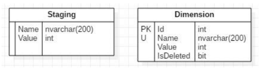

# Description

Tasks 2-4 are about Microsoft SQL Server.

## TODO

### Task 2

Write TSQL script to create database schema:

### Task 3

Write a script to create stored procedure LoadDimension. This procedure should load the data from the
Staging table to Dimension table:

1. If the value in the Name field exists in the Staging table and not in the Dimension table then add
row in the Dimension table
2. If the value in the Name field exists, both in the Staging and in the Dimension tables, then
update row in the Dimension table
3. If the value in the Name field in the Dimension table exists, but is not present in the Staging
table, then set IsDeleted to '1'

### Task 4

Use tSQLt [https://tsqlt.org](https://tsqlt.org) and write test to check logic of LoadDimension procedure.

## Execution

In order to prepare environment following step should be performed:

1. Execute `./docker-compose up`.
1. Execute `./Task-2.sql`.
1. Execute `./Task-3.sql`.
1. Execute `./tSQLt/PrepareServer.sql`.
1. Execute `./tSQLt/tSQLt.class.sql.sql`.
1. Execute `./Task-4.sql`.
